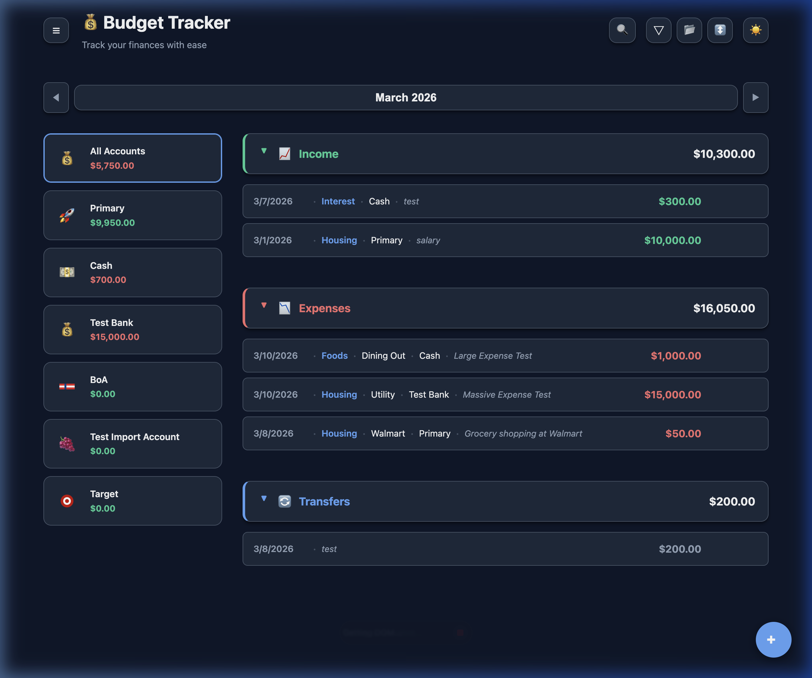
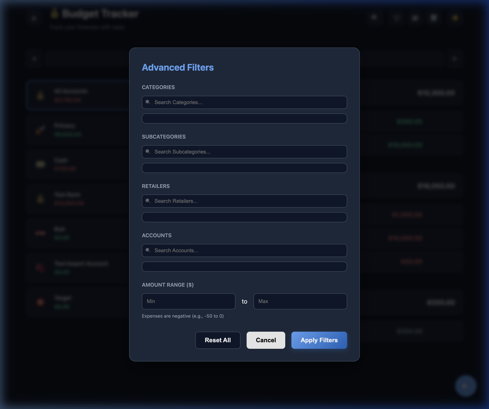
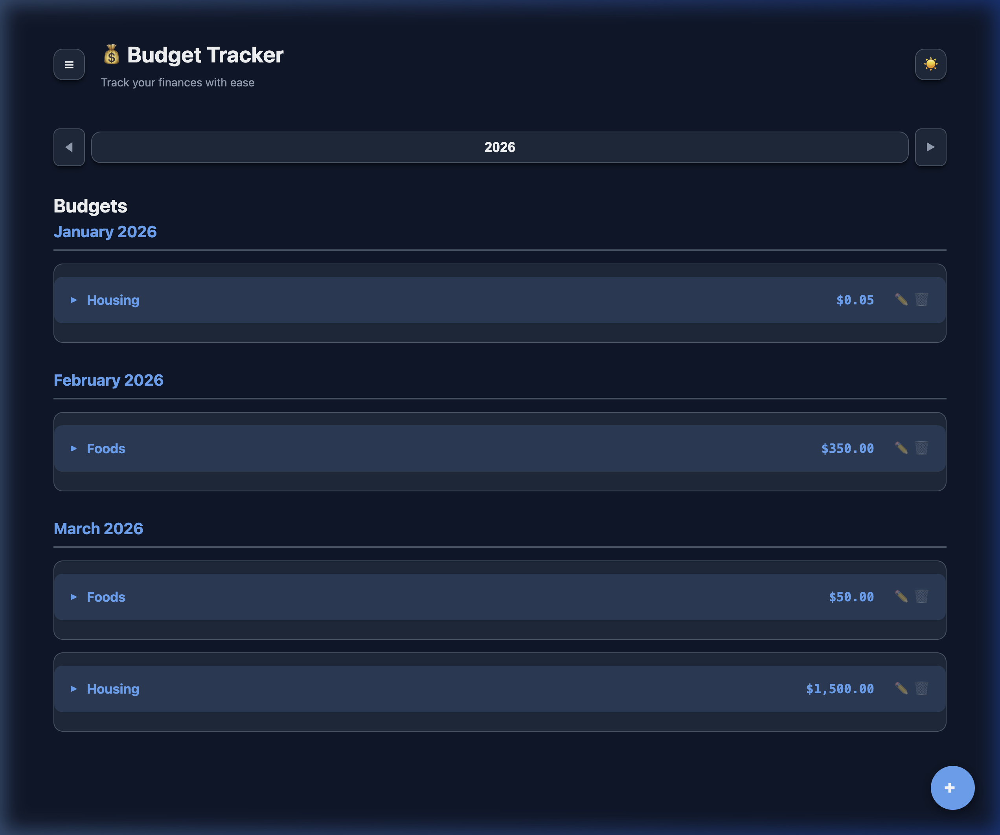
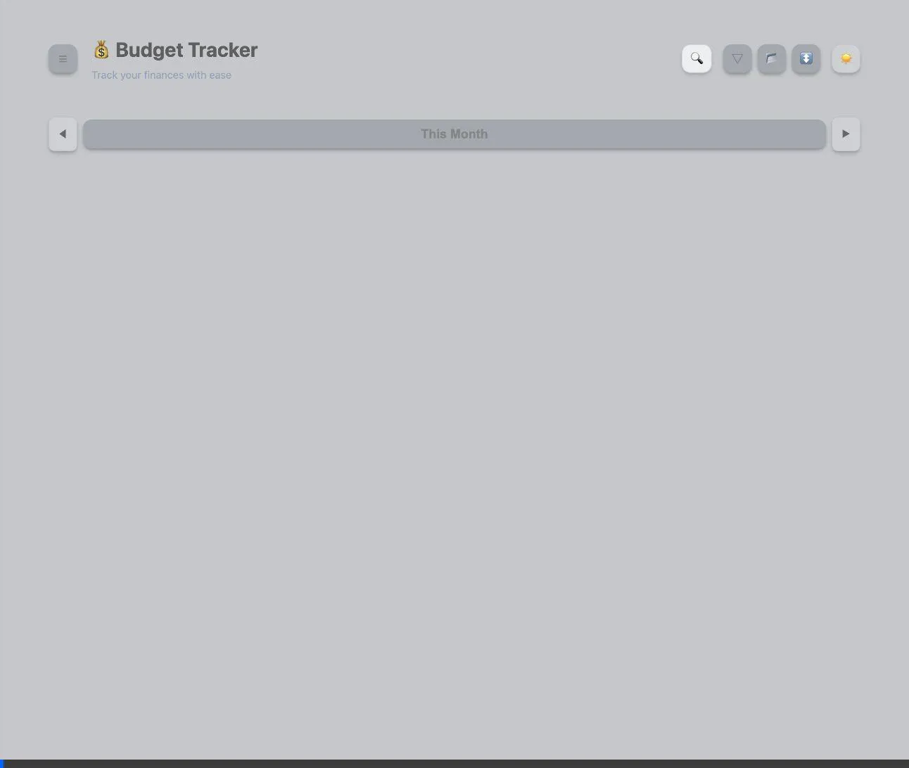
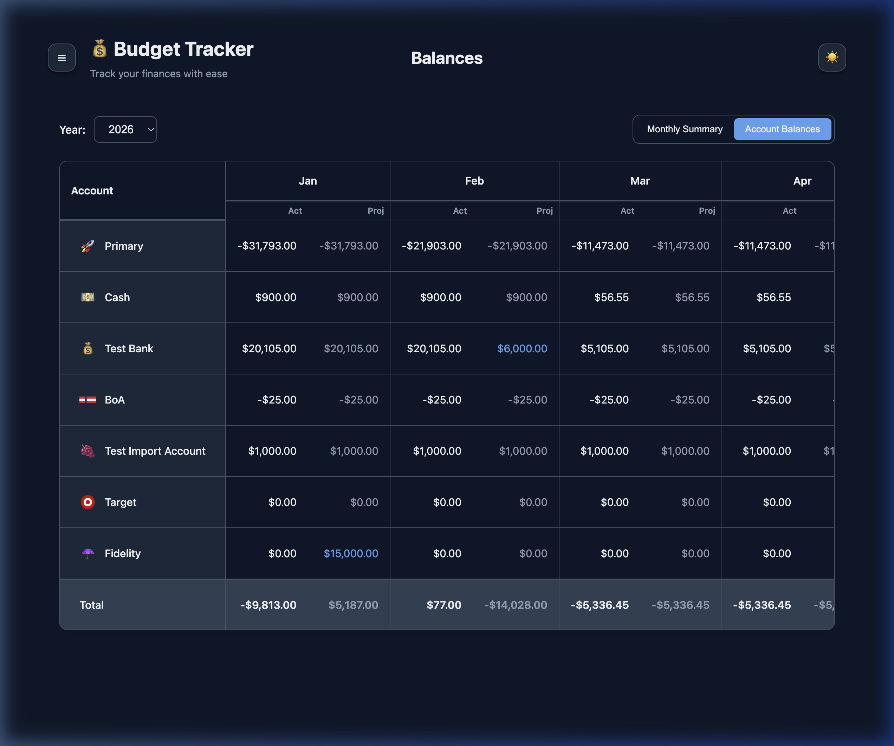
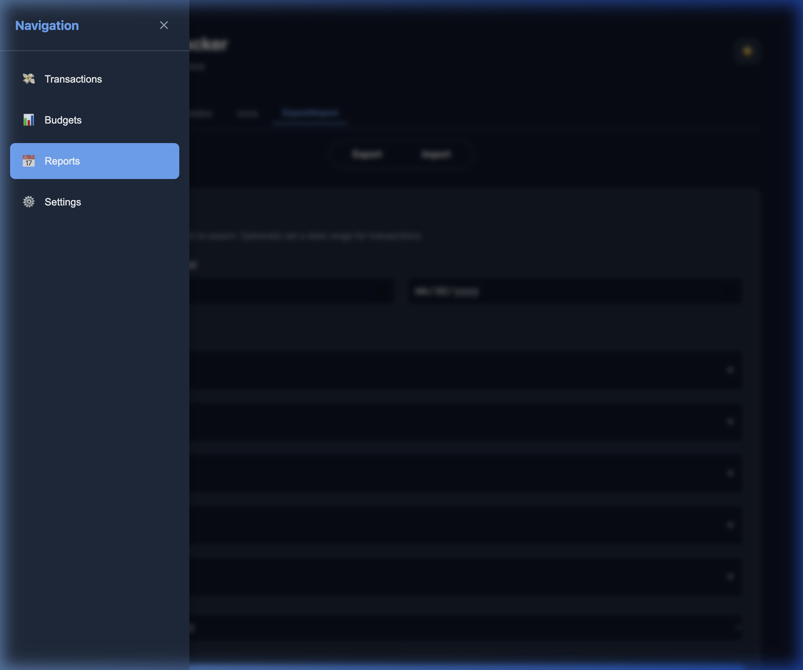
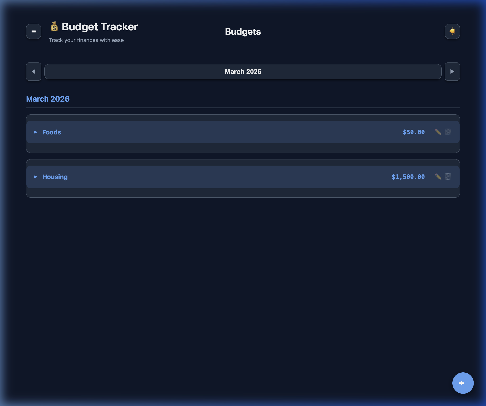
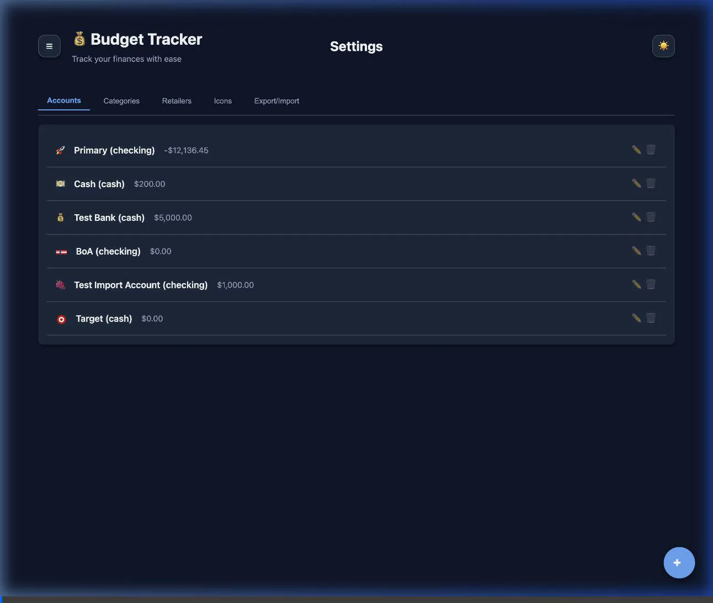

# Budget N Expenses 💰

A modern, responsive web application for tracking budgets, expenses, and financial health. Architected with ease of use and visual clarity in mind, this tool helps you stay on top of your finances with real-time tracking and professional reporting.


## ✨ Features

### 📊 Comprehensive Dashboard
Get an instant overview of your financial health. View total balances, recent transactions, and spending breakdowns at a glance.


### 💸 Transaction Management
Seamlessly track every cent. Advanced filtering by category, account, or amount range ensures you can find exactly what you're looking for.
- **Filters**: Quickly narrow down data by date, type (Income/Expense/Transfer), or specific retailers.


### 📈 Budget Management & Planning
Take control of your spending with a powerful, hierarchical budgeting system.
- **Hierarchical View**: Navigate from high-level categories down to specific line items with expandable groups.
- **Smart Filtering**: Filter budgets by full years or specific months. Selecting a year shows an overview of all months for that year.
- **Simplified Controls**: Specialized date dropdowns for budgets ensure clarity when planning for the future.



### 📈 Professional Reporting
Visualize where your money goes with dynamic spending charts and comparisons.
- **Report Toggle**: Seamlessly switch between different reports using the selection dropdown.
- **Spending by Category**: Distribution of expenses across categories using doughnut charts.
- **Budget vs Spend**: Side-by-side comparison of budgeted amounts vs actual spending per category.
- **Balance Trend (Actual vs Projected)**: Monthly line chart comparison of your total net worth (Accounts + Assets), including future projections.


### 🏠 Asset Management
Track your physical and financial assets alongside your liquid accounts.
- **Dynamic Asset Tracking**: Manage property, vehicles, and other assets.
- **Projected Worth**: Ability to specify and track the projected worth of your assets at a year and month level.
- **Balanced View**: Asset values and projections are integrated into the "Monthly Summary" for a complete picture of your net worth.


### ⚖️ Historic Balances
Retrace your financial history with a powerful retroactive balance engine.
- **Monthly Summary**: See your total starting balance, income, expenses, and ending balance for any month in history.
- **Account Matrix**: A comprehensive grid showing exactly how much was in every single account at the end of every month.
- **Retroactive Engine**: Automatically calculates historical states by reverse-engineering the transaction ledger from your current balances.
- **Projected Worth**: Specifically designed for investment and stock accounts, allowing you to track and visualize projected future/current values alongside actual transaction-based balances.



### 🛡️ Secure Data Management
Take full control of your data with built-in Export and Import tools. Securely merge records or migrate to other platforms via JSON or CSV.


### 🎨 Modern Navigation & Clarity
Experience a sleek, intuitive interface designed for focus.
- **Centered Page titles**: Top-center page labels for instant context.
- **Dynamic Themes**: Seamlessly switch between light and dark modes.
- **Clean Layout**: A clutter-free design that hides redundant information.



---

## 🎨 Customizing Icons
The application supports a wide range of icons, including generic emojis and professional brand logos (Bank of America, Chase, Target, etc.).

### Using Preset Icons
1. Open the "Add" or "Edit" modal for an account, category, or retailer.
2. Scroll through the icon grid and select your preferred icon.

### Managing the Icon Library
You can permanently add or remove icons from your library via the Settings menu:
1. Navigate to **Settings** -> **Icons** tab.
2. **To Add**: Enter an emoji or a full SVG string in the input field at the bottom and click **Add**.
   - **Emoji Example**: `🧙‍♂️` or `🌋`
   - **SVG Example**: `<svg width="20" height="20"><circle cx="10" cy="10" r="8" fill="red" /></svg>`
3. **To Remove**: Click the trash icon (🗑️) on any icon card.
4. Added icons will immediately become available in all selection grids (Accounts, Categories, etc.).

---

## 🛠️ Getting Started

### Prerequisites
- **Node.js**: v20 or later
- **npm**: v10 or later

### 🚀 Installation & Setup

1. **Clone the repository**:
   ```bash
   git clone <repository-url>
   cd budget-n-expenses
   ```

2. **Backend Setup**:
   ```bash
   cd backend
   npm install
   # Initialize data (if first time)
   mkdir -p data
   cp data/*.json.example data/
   # Start the server
   npm start
   ```
   *The backend will run on `http://localhost:3001`.*

3. **Frontend Setup**:
   In a *new* terminal window:
   ```bash
   cd frontend
   npm install
   npm run dev
   ```
   *The application will be available at `http://localhost:5173`.*

---

## 🛑 Stopping & Maintenance

### Stopping the Services
- **Standard**: Press `Ctrl + C` in the respective terminal windows.
- **Force Stop (if port is blocked)**:
  - Backend: `lsof -ti:3001 | xargs kill -9`
  - Frontend: `lsof -ti:5173 | xargs kill -9`

### Running Tests
Ensure reliability before pushing changes:
- **Backend**: `cd backend && npm test`
- **Frontend**: `cd frontend && npm test`

---

## 🔍 Troubleshooting

| Issue | Potential Solution |
| :--- | :--- |
| **Port 5173 / 3001 already in use** | Use the "Force Stop" commands above to clear zombie processes. |
| **Icons not rendering** | Ensure SVG strings are complete and start with `<svg`. Emojis require internet for some browser rendering. |
| **Empty Dashboard** | Verify that `backend/data/*.json` files are correctly initialized from `.example` files. |
| **Connection Refused** | Ensure the backend server is running *before* starting the frontend. |

---

## 🏗️ Project Structure
- `backend/`: Express server with robust, JSON-base storage and API logic.
- `frontend/`: High-performance UI built with Vite and Vanilla JS.
- `requirements/`: Architectural blueprints and product requirements.